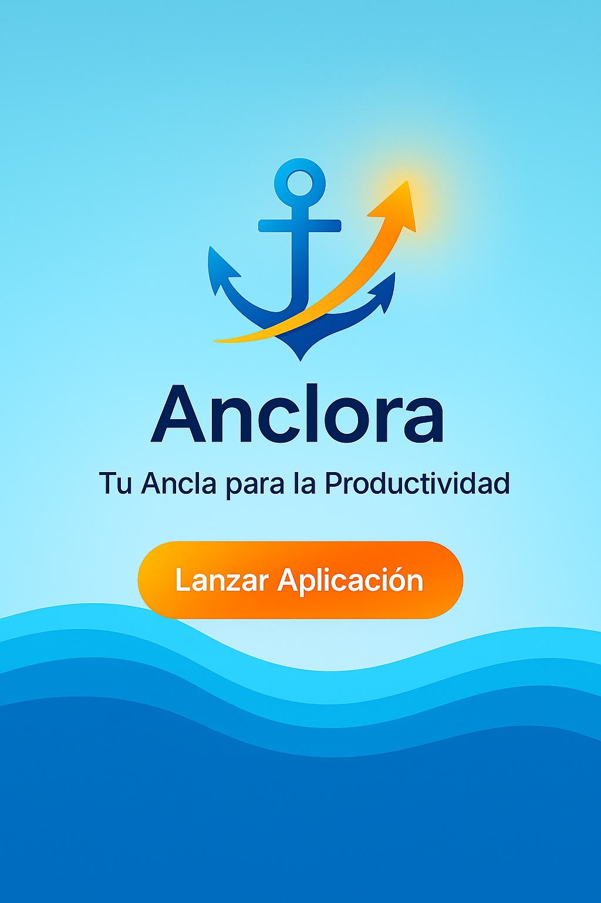

# ⚓ Anclora – Your Anchor for Productivity



**Anclora** is a modern, clean, and animated web application to help you organize your tasks with clarity and flow. Inspired by the rhythm of the sea, it offers a lightweight experience directly from your browser.

---

## 🌟 Features

- Animated floating logo with wave effects
- Fully responsive and elegant landing page
- Clean layout, GitHub Pages ready
- Open Source (MIT License)
- Informative sections: benefits, testimonials, contact

---

## 🚀 Access

🔗 [View Landing](https://<your-user>.github.io/Anclora-web/)  
🔗 [Launch App](https://<your-user>.github.io/Anclora-web/anclora.html)

---

## 📁 Repository Structure

```
Anclora-web/
├── index.html                  # Main landing page
├── anclora.html                # App interface
├── assets/
│   └── anclora-preview.png     # Preview image / Open Graph
├── LICENSE
├── README.md                   # Spanish version
├── README_EN.md                # English version
└── .gitignore
```

---

## 🌐 Deployment Guide

1. Upload the contents to a public GitHub repo (`Anclora-web`)
2. Enable GitHub Pages in the repo settings
3. Choose the `main` branch and root folder (`/root`)
4. Visit: `https://<your-user>.github.io/Anclora-web/`

---

## 🤝 Contributing

Forks, pull requests, and suggestions are welcome!

---

## 📬 Contact

✉️ hola@anclora.app

---

## 🧾 License

Distributed under the [MIT License](LICENSE).
